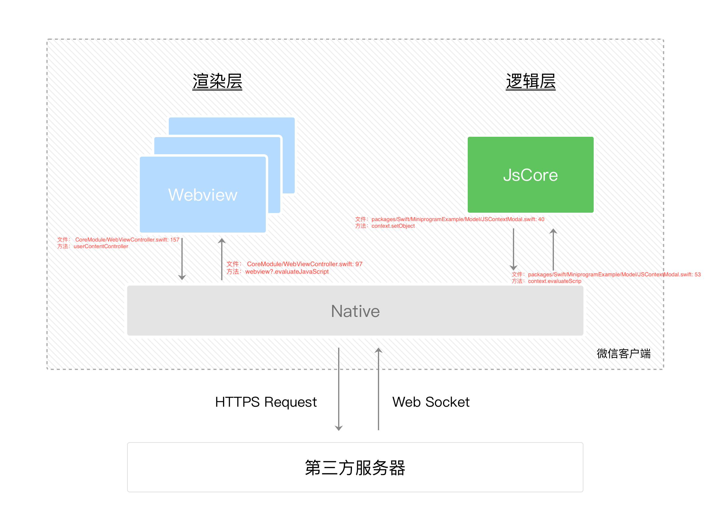
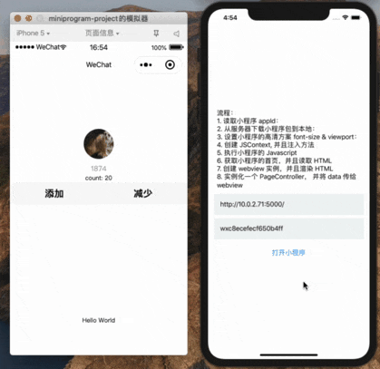

# 一个简单的微信小程序运行时

## 项目要求/支持

- xcode
- 目前仅支持 iOS

## 项目结构

- miniprogram-project
    - 微信开发工具创建的小程序项目
- packages/compiler
    - 编译相关，负责将小程序源文件编译成可运行的模块 (JSCore)
- packages/runtime
    - 基础组件 + vue 渲染模块 (Webview)
- packages/swift
    - 原生代码块 (Native)

## 快速启动

### 1. 在根目录安装依赖(时间会比较久)
```bash
# 安装 JS 依赖
yarn
```
### 2. 进入 packages/Swift 安装 Native 依赖:
```bash
cd packages/Swift

# 安装 swift 依赖
# 如果没有安装 cocospod 需要先安装
pod install
```
### 3. 将编译命令行工具 link 到全局
```bash
cd packages/compiler
yarn link # or npm link 注册 rmini命令行工具
```

### 4. 编译小程序项目
```bash
cd miniprogram-project

# 编译项目
rmini 
# 如果不使用 rmini, 则: node ../packages/compiler/cli/index.js
# 获取到编译后的源文件
```

### 5. 将编译后的文件放在服务器中，用于在 Native 中下载
```bash
# 为了简单起见，直接在本地起一个服务器

serve /var/folder/xxx/xxx/wxc8ecefecf650b4ff/../
```

### 6. 启动 App

1. 进入 packages/Swift 项目
2. 打开 MiniprogramExample.xcworkspace 文件
3. 运行 App 修改服务器地址以及 Appid, 或修改 ContentView 中的服务器以及 Appid

## 流程简介

> 这是一张从小程序官方薅来的图



1. 小程序启动后，通过 JSCore 运行脚本，并且注入 bridge (CoreModule/MiniprogramController.swift:39)
2. 初始化一个 Webview, 并调用 JSCore 中的 init, 运行 **onLaunch** 生命周期
3. JSCore 中 init 后，将首页返回给原生
4. 原生根据首页路径找出对应的 HTML 文件，并用 Webview 渲染
5. 加载 HTML 前调用 **onLoad** 生命周期
6. 将 HTML 文件加载后调用 **onReady** 生命周期
7. 原生的 ViewController 调用 viewDidAppear 生命周期时调用 **onShow**
8. 原生的 ViewController 调用 viewDidDisappear 生命周期时调用 **onHide**
9. 页面退出后调用 **onUnload** 生命周期

## 效果图


